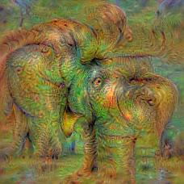
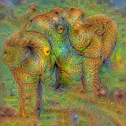
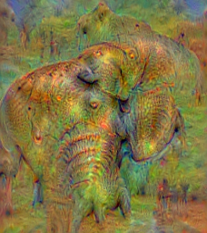

# ImageFromClass

Makes images from network output class.  See: https://github.com/auduno/deepdraw

"With four parameters I can fit an elephant, and with five I can make him wiggle his trunk." - Jon von Neumann

Convolutional neural networks have lots of parameters!

  

